# PulseShift

**A local-first crypto research lab: live Binance data, an AI signal model,
validated strategies, backtests and paper trading, in one dashboard on your
own computer.**

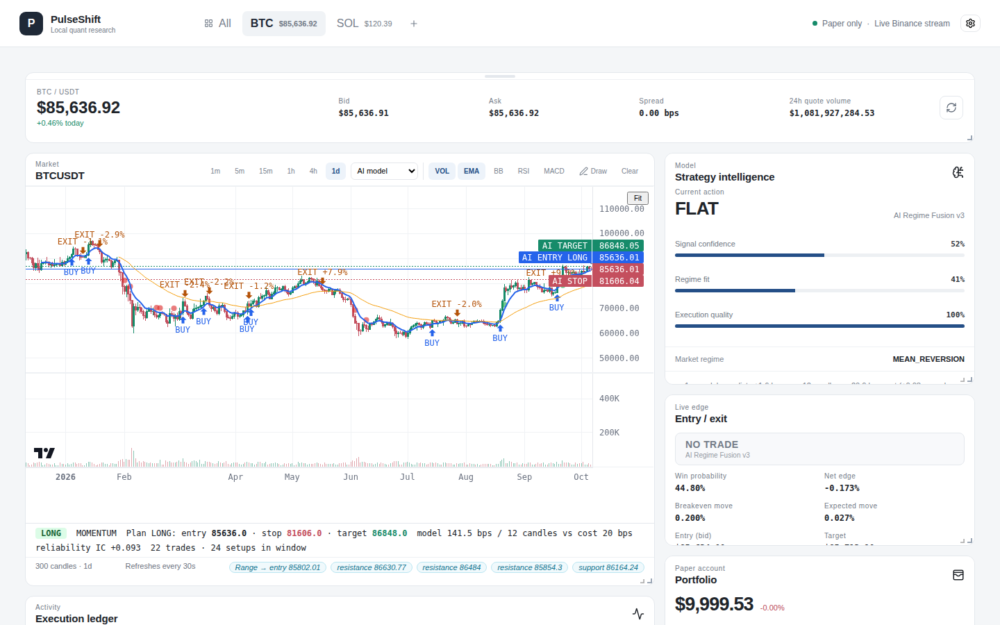

PulseShift streams public market data from Binance, runs 15 strategies on
it side by side (including an AI model trained per timeframe), draws their
entry/stop/target signals on the chart, and lets you paper-trade, backtest,
evolve and forward-test them. It also includes the research tooling used to
build them, so you can test your own ideas the same way.

> **Paper trading only.** PulseShift never places real orders and needs no
> exchange account or API keys. It is research software, not financial
> advice. See [Safety](#safety).

## Contents

- [Quick start](#quick-start)
- [A tour of the app](#a-tour-of-the-app)
- [How signals are generated](#how-signals-are-generated)
- [How the AI is integrated](#how-the-ai-is-integrated)
- [Reuse it: strategies, API, your own AI](#reuse-it)
- [Experiment yourself](#experiment-yourself)
- [Configuration](#configuration)
- [Project layout](#project-layout)
- [Development](#development)
- [Safety](#safety) · [License](#license)

## Quick start

You need **Python 3.11+** and **Node.js 20.19+** (or 22.12+).

**macOS / Linux**

```bash
git clone https://github.com/lewisjohnvillamor/Pulse-shifting.git
cd Pulse-shifting
./start-dev.sh            # installs everything, starts API + UI
```

**Windows**

```bat
git clone https://github.com/lewisjohnvillamor/Pulse-shifting.git
cd Pulse-shifting
start-dev.bat
```

Then open **http://127.0.0.1:5173**. The API runs on
http://127.0.0.1:8000 (interactive docs at `/docs`).

<details>
<summary>Manual setup</summary>

```bash
python3 -m venv .venv
.venv/bin/pip install -r requirements.txt
.venv/bin/uvicorn app.main:app --port 8000      # terminal 1
cd web && npm install && npm run dev            # terminal 2
```
</details>

## A tour of the app

### Pin coins and switch between them

Click **+** in the top bar and type a coin. Exact matches come first and
**Enter** pins the top result. Each pinned coin gets a tab; **All** shows
every pinned coin side by side.

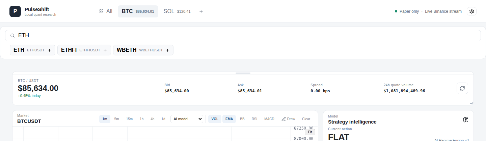

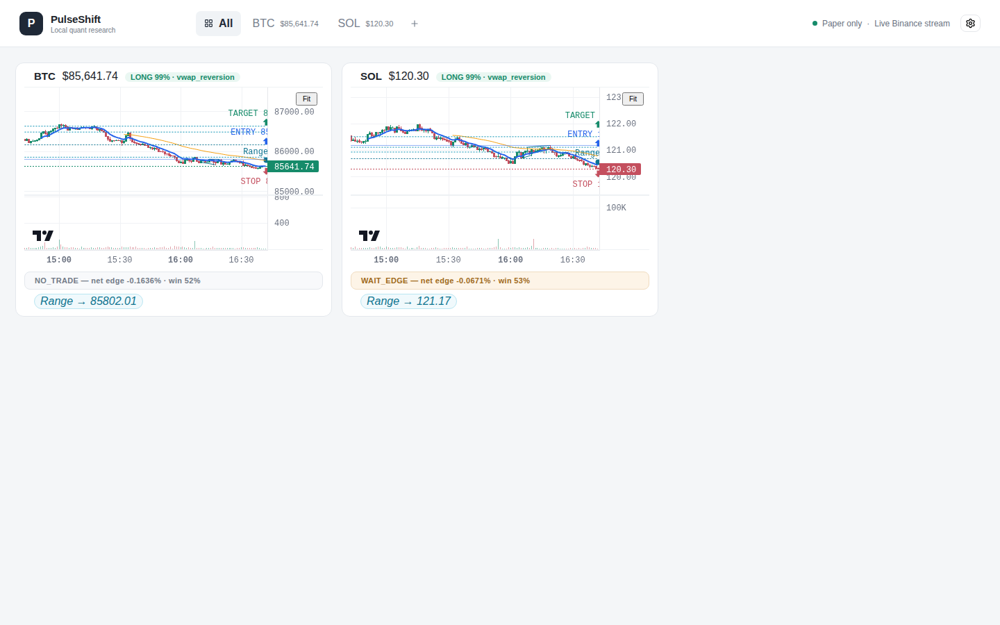

### The chart: signals drawn for you

Pick a **timeframe** (1m to 1d) and **whose signals to draw** (AI model or
Trend). The chart then marks, automatically:

- **BUY / EXIT arrows**: where the strategy would have entered and left in
  this window, each exit labelled with that trade's % result;
- **setup dots** (green/red): the AI model's strongest leans, which don't
  necessarily beat fees;
- **AI ENTRY / AI STOP / AI TARGET lines**: the current plan, solid when
  actionable and dashed when watch-only.

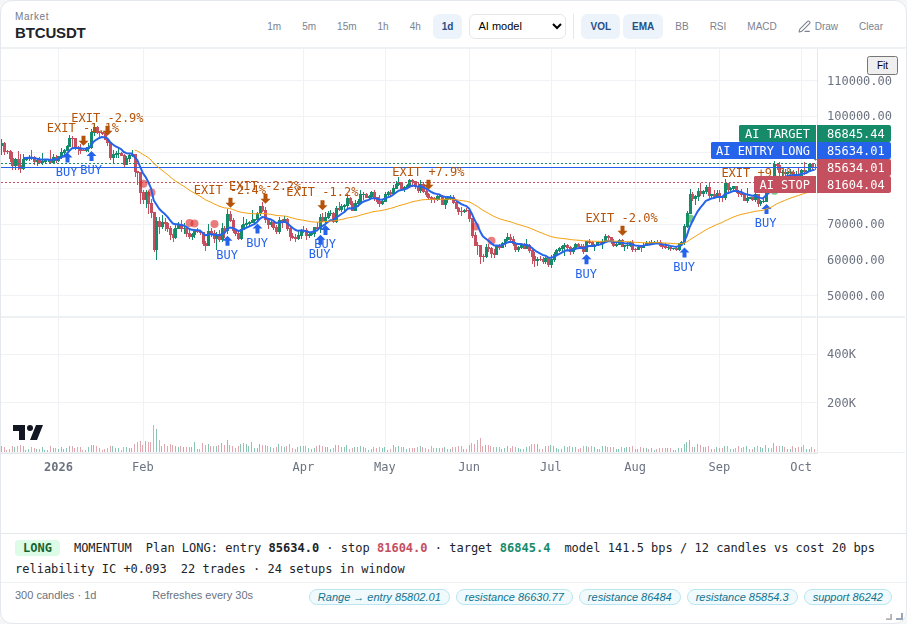

The strip under the chart explains the call: action, regime, plan prices,
predicted move against trading cost, and how reliable the model has been on
this timeframe. On fast candles the model usually says *watch*, because the
predicted move is smaller than the fees:

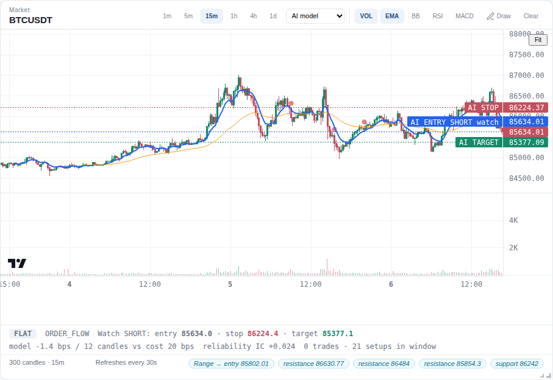

The **Trend** overlay shows the validated trend strategy instead, with its
suggested position size:

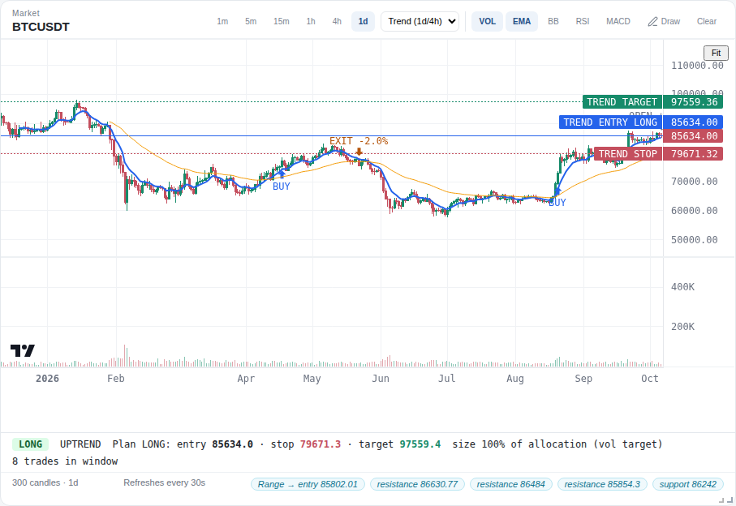

### Strategy intelligence, edge and the strategy board

Click any strategy on the **Strategy board** to focus it. **Strategy
intelligence** then shows its call, confidence and editable parameters.
**Entry / exit** turns that call into a fee-aware verdict: `ENTER_LONG`,
`WAIT_EDGE` (signal exists but costs eat it) or `NO_TRADE`.

| Strategy intelligence | Entry / exit | Strategy board |
|---|---|---|
| 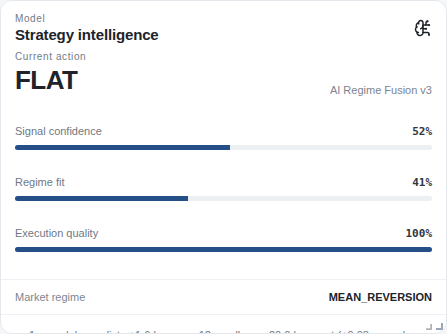 | 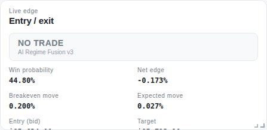 | 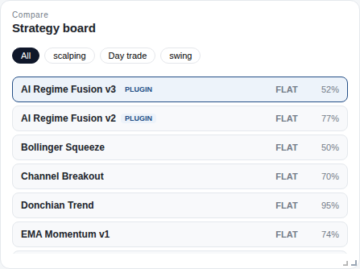 |

### Paper trading

Buy, sell or close with simulated fills at the live bid/ask (10 bps fee).
The account survives restarts (`data/paper_account.json`) and **Reset** asks
before erasing it.

| Portfolio | Execution ledger |
|---|---|
| 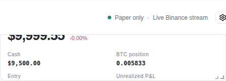 | 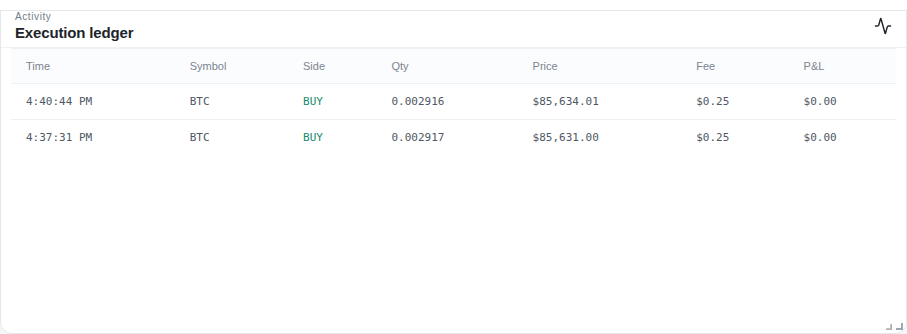 |

### Backtest and evolve any strategy

The **Strategy arena** replays any strategy on any coin, timeframe and date
range, drawing its trades on the chart with return, win rate, drawdown and
profit factor:

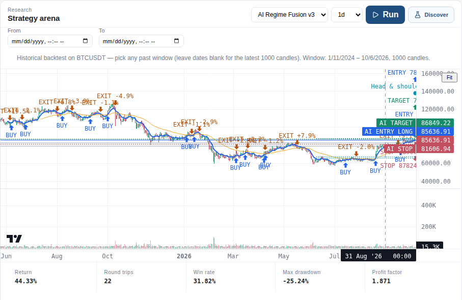

**Discover** runs an evolutionary search over the strategy's parameters. It
trains on the oldest 60%, picks on the next 20%, and only then reveals the
untouched last 20%. **Promote champion** applies the winner; nothing changes
until you click it.

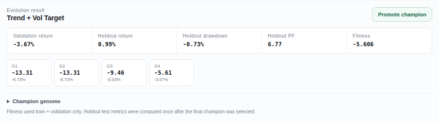

### Trend portfolio and forward test

**Trend portfolio** lists today's target weight for 38 coins under the one
strategy that survived out-of-sample testing (details in
[docs/RESEARCH.md](docs/RESEARCH.md)). **Forward test** records those
weights and the AI's daily calls every day from now on and scores them
against what the backtests predicted. A stop rule fixed in advance decides
whether the edge is real.

| Trend portfolio | Forward test |
|---|---|
| 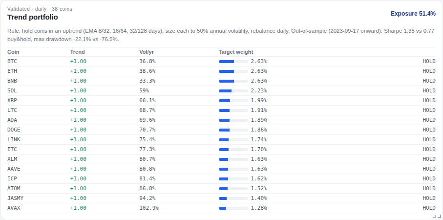 | 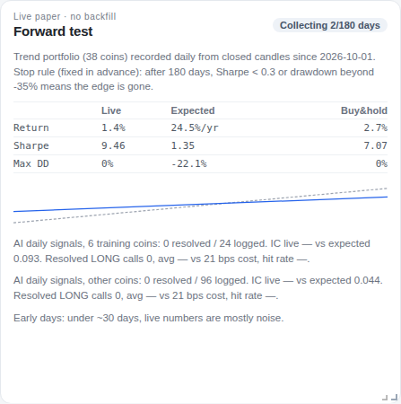 |

## How signals are generated

```
Binance public data ──► candles (+ taker-buy order flow)
   REST + websocket            │
                               ▼
              ┌────────── 15 strategies ──────────┐
              │  Strategy.decide(candles, spread) │  one Decision each:
              │  rules · AI model · trend · yours │  action, confidence,
              └───────────────┬───────────────────┘  regime, reasons, levels
                              ▼
     ┌──────────────┬─────────┴────────┬──────────────────┐
     ▼              ▼                  ▼                  ▼
 edge card      chart overlay      backtest /          forward test
 (fees+spread   (BUY/EXIT, setups, evolution           (daily record,
  vs expected    plan lines)       (replay history)     live scoring)
  move)
```

Every strategy implements one method, `decide(candles, spread_bps)`, and
returns a **Decision**: an action (`LONG` / `SHORT` / `FLAT`), a
confidence, a regime label, human-readable **reasons**, and optional
**levels** (entry, stop, target, and a position **size**). Everything else
consumes that same object:

- the **live dashboard** calls it on every market update;
- the **edge card** checks whether the expected move beats spread plus
  2× fees;
- the **chart** replays it over the visible window to draw past trades, and
  draws the current `levels`;
- **backtests**, **evolution** and the **research CLIs** replay it over
  history, calling `should_exit()` while a position is open.

So a strategy you add shows up everywhere at once.

## How the AI is integrated

There are three layers, from built-in to bring-your-own.

**1. The AI model (`ai_regime_fusion`, "AI Regime Fusion v3").** A
statistical model trained on 6 coins across 1m–1d candles
([`app/features.py`](app/features.py), [`app/modeling.py`](app/modeling.py),
weights in [`app/models/fusion_model.json`](app/models/fusion_model.json)).

- **Inputs:** 24 inputs from each candle history: momentum, distance from
  moving averages, RSI, VWAP, range position, volatility regime, volume, and
  **taker-buy order flow**.
- **Why one model per timeframe:** research showed the same inputs point
  opposite ways on different timeframes. Fast candles snap back (mean
  reversion), 15m follows order flow, and daily candles trend. A single
  model cancelled itself out.
- **What it keeps:** for each timeframe, only factors whose direction held
  across coins *and* across time in training.
- **What it does with a prediction:** it predicts the move over the next 12
  candles. It trades only when that move beats trading costs, and abstains
  on timeframes where it showed no out-of-sample skill.
- **Measured reliability (IC):** +0.04 on 1m, +0.02 on 15m, **+0.09 on
  1d**; none on 1h/4h, where it abstains. Every number shown in the UI comes
  from tests on unseen data.

**2. Validated portfolio strategy (`trend_vol_target`).** Trend following
with volatility-scaled sizing. Of six published ideas tested out of sample
(trend, cross-coin momentum, time-of-day, BTC lead-lag, funding rates,
gradient boosting), it was the only one that held up. Out-of-sample
results:

| | Sharpe | Worst drop |
|---|---|---|
| Trend portfolio, 38 coins | **1.35** | **−22%** |
| Buy-and-hold, same coins | 0.77 | −76% |
| BTC buy-and-hold | 1.04 | −53% |

**3. Bring your own model or LLM.** Two adapters forward candles to a model
you run and turn its JSON reply into a strategy:

- **Laya** (`strategies/laya.py`) calls a local endpoint (`LAYA_URL`).
  [`examples/my_ai_server.py`](examples/my_ai_server.py) is a complete
  server to start from.
- **Jev** (`strategies/jev.py`) calls a hosted endpoint with an API key, set
  in the **settings gear**. OpenAI-style chat replies are understood.

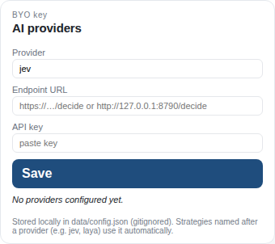

Keys are stored only in `data/config.json` (gitignored) and masked by the
API. If an endpoint is unreachable, the adapter abstains and waits 60 s
before retrying, so it never stalls the dashboard or a backtest.

## Reuse it

### Add a strategy without code (JSON)

Drop a file in `strategies/`, reusing a built-in rule set with your own
parameters:

```json
{
  "id": "fast_scalp",
  "name": "Fast Scalp",
  "kind": "ema_momentum",
  "params": { "fast": 5, "slow": 13, "lookback": 3, "threshold": 0.55 }
}
```

### Add a strategy in Python

Copy the commented template and edit `decide()`:

```bash
cp examples/strategies/rsi_dip.py strategies/
curl -X POST localhost:8000/api/strategies/reload   # or restart the API
```

It appears on the Strategy board, in the arena, in evolution and on the
chart. Return `levels` to get plan lines drawn; override `should_exit()` to
control exits in backtests. See [strategies/README.md](strategies/README.md).

### Use the API from your own code

Everything in the UI is plain HTTP (interactive docs at
http://127.0.0.1:8000/docs). [`examples/api_client.py`](examples/api_client.py)
fetches signals, live calls, the trend portfolio, a backtest and an
optional paper order:

```bash
python examples/api_client.py --symbol ETHUSDT --interval 1d
```

| Endpoint | What it gives you |
|---|---|
| `GET /api/signals?symbol=&interval=&strategy=` | candles, BUY/EXIT markers, current decision and plan, for any timeframe |
| `GET /api/market?symbol=` | live price, every strategy's decision and edge card |
| `GET /api/backtest?symbol=&interval=&strategy=` | replay with trades, stats and chart markers |
| `GET /api/portfolio/trend` | today's trend-portfolio weights |
| `GET /api/forward` | forward-test results vs expectations |
| `POST /api/evolution/run` | evolutionary parameter search |
| `POST /api/order` | paper order (BUY / SELL / CLOSE) |

## Experiment yourself

All research tools are command-line scripts. Downloaded data is cached under
`data/research/`, so repeat runs are fast and offline.

```bash
# Is my strategy any good on data it never saw? (honest verdict vs buy&hold)
python examples/walk_forward_my_strategy.py strategies/your_strategy.py

# Tune a strategy on old data, score it on newer data, across 16 markets
python -m app.research --strategy ai_regime_fusion --tune

# The AI model: predictive power per timeframe, unseen-data backtests, retrain
python -m app.modeling eval
python -m app.modeling eval-trade --fee-bps 2     # what if your fees were lower?
python -m app.modeling train                      # refit; commit the JSON

# The six researched effects, each tested out of sample
python -m app.alphalab trend --universe expanded
python -m app.alphalab seasonality                # also: xsmom, leadlag, funding, gbm

# Forward test from the command line (e.g. a daily cron job)
python -m app.forward record
python -m app.forward report
```

Ideas to try:

- Change `entry_cost_mult` or `fee_bps` on the AI model (Strategy
  intelligence panel) and watch how many signals clear costs.
- Plug a model into `examples/my_ai_server.py` and backtest **Laya** against
  the built-ins.
- Add an input to `app/features.py`, run `python -m app.modeling eval`, and
  keep it only if out-of-sample IC improves.

The full methodology and every result, including the ideas that failed, is
in **[docs/RESEARCH.md](docs/RESEARCH.md)**.

## Configuration

Copy `.env.example` to `.env` to change ports, hosts, the data directory or
the Laya URL. The API and the UI read the same file. There are no secrets
in this project, and `.env` and `data/` are gitignored.

| Variable | Default | Purpose |
|---|---|---|
| `PULSESHIFT_PORT` / `PULSESHIFT_HOST` | `8000` / `127.0.0.1` | API address |
| `PULSESHIFT_CORS_ORIGINS` | the UI's address | who may call the API |
| `PULSESHIFT_DATA_DIR` | `./data` | watchlist, paper account, forward records, caches |
| `VITE_API_URL` | `http://127.0.0.1:8000` | where the UI finds the API |
| `VITE_PORT` | `5173` | UI port |
| `LAYA_URL` | `http://127.0.0.1:8791/decide` | your local model endpoint |

## Project layout

```
app/
  main.py          FastAPI app: REST + websocket endpoints
  market.py        Binance public REST client      live_market.py  websocket feeds
  strategy.py      Strategy/Decision API + built-in rule strategies
  registry.py      loads built-ins + plugins from strategies/
  backtest.py      replay engine + chart overlays   evolution.py  parameter search
  paper.py         paper broker (persisted)         signals.py    fee-aware edge card
  features.py      model inputs                     modeling.py   train/evaluate the AI model
  portfolio.py     trend portfolio                  forward.py    forward test
  research.py      walk-forward CLI                 alphalab.py   six researched effects
  ai.py, config.py bring-your-own AI providers      settings.py   .env configuration
  models/fusion_model.json   trained AI model weights
strategies/        plugins: AI model v3/v2, trend, Laya, Jev, JSON example
examples/          strategy template, API client, walk-forward script, AI server
web/src/           React + TypeScript dashboard (main.tsx, styles.css)
docs/              RESEARCH.md + screenshots
tests/             pytest suite
```

## Development

```bash
.venv/bin/pip install ruff pre-commit pytest pytest-asyncio
.venv/bin/pre-commit run --all-files   # lint + format
.venv/bin/pytest                       # tests
cd web && npm run build                # type-check + build
```

Contributor conventions are in [AGENTS.md](AGENTS.md).

## Safety

- PulseShift **does not place real orders**. There is no exchange-credential
  code path; execution is a local paper broker.
- Market data comes only from Binance **public** endpoints.
- Backtests and research use survivorship-biased coin lists (coins that
  still trade today), which flatters long-only results. Treat absolute
  returns as optimistic.
- The forward test exists because backtests can be overfit by accident.
  Wait for its verdict before trusting any strategy with real money.

## License

MIT, see [LICENSE](LICENSE). Research software provided as is, with no
warranty and no financial advice.
